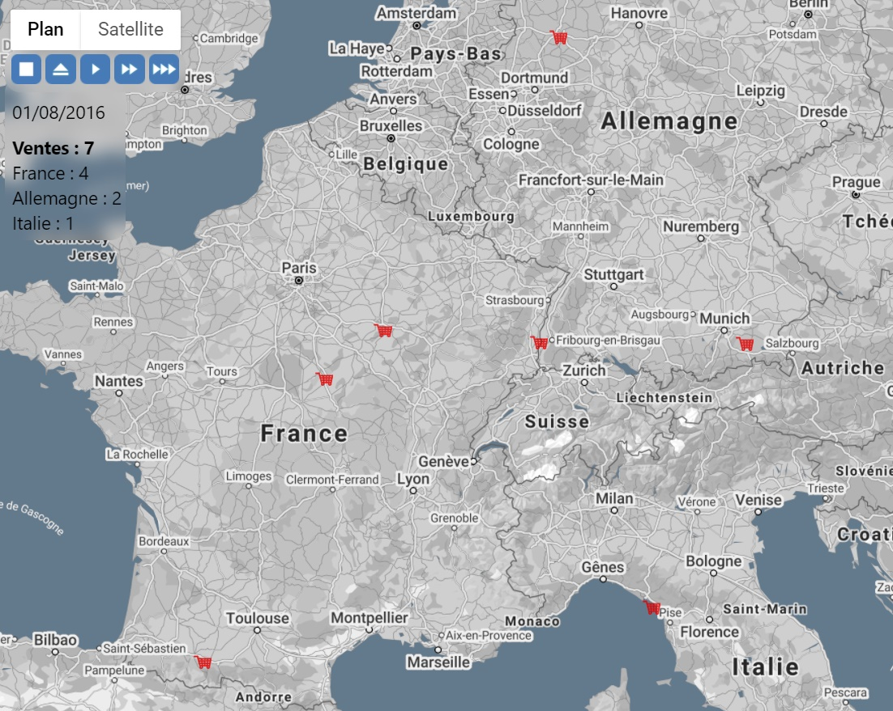

### from CSV to map est une application React
#### Elle fait apparaître des markers sur Google maps en fonction des dates assignées dans un fichier CSV



#### Fonctionnement :
  
* uploadez un fichier CVS avec dates et adresses (ex : des ventes)
_* le fichier CSV doit être formulé ainsi :
```
postcode;country;date;
"10440";"France";"01/01/2015";
"88046";"Italie";"01/06/2016";
"83043";"Allemagne";"01/01/2016";
```_
* l'app convertit les données en tableau JS exploitable par l'application
* cliquez sur PLAY (3 vitesses de déploiement possibles)
* les adresses sont converties en coordonnées GPS / geocoding en faisant appel à l'API de Google Maps
* de ce nouveau tableau, les markers correspondant aux ventes s'affichent chronologiquement sur une carte Google maps
* plusieurs compteurs affichent l'augmentation du nombre de ventes par pays au fur et à mesure du déploiement des markers
